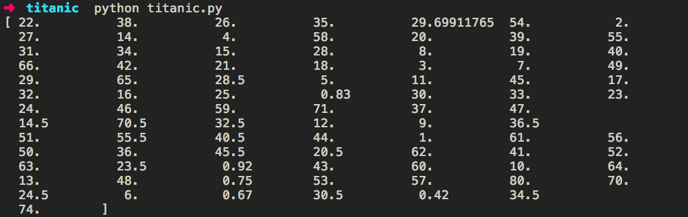

You can fetch the training data and test data from 
<a href="https://www.kaggle.com/c/titanic/data"
target="_blank">kaggle</a>.

Loading the data:

import pandas as pd

class Titanic:
    def __init__(self, training_file, test_file):
        self.training_data = pd.read_csv(training_file)
        self.test_data = pd.read_csv(test_file)


Analyzing the data:

import pandas as pd

class Titanic:
    def __init__(self, training_file, test_file):
        self.training_data = pd.read_csv(training_file)
        self.test_data = pd.read_csv(test_file)

    def describe_training_data(self):
        print(self.training_data.describe())

titanic = Titanic('train.csv', 'test.csv')
titanic.describe_training_data()


The count of Age is is 714 where as the count of all other columns is
891. This could mean that we are missing some data for age.

Lets see the list of values the column age has.

Analyzing the data:

import pandas as pd

class Titanic:
    def __init__(self, training_file, test_file):
        self.training_data = pd.read_csv(training_file)
        self.test_data = pd.read_csv(test_file)

    def describe_training_data(self):
        # print(self.training_data.describe())
        print(self.training_data['Age'].unique()

titanic = Titanic('train.csv', 'test.csv')
titanic.describe_training_data()


We can see that some of the values are nan (not defined), lets replace
them with the mean age.

import pandas as pd

class Titanic:
    def __init__(self, training_file, test_file):
        self.training_data = pd.read_csv(training_file)
        self.test_data = pd.read_csv(test_file)

    def describe_training_data(self):
        print(self.training_data.describe())

    def process_age_for(self, data):
        data['Age'] =
data['Age'].fillna(self.training_data['Age'].mean())

    def clean_training_data(self):
        self.process_age_for(self.training_data)
        print(self.training_data['Age'].unique())

titanic = Titanic('train.csv', 'test.csv')
titanic.clean_training_data()


There are no more nan values in the Age columns
