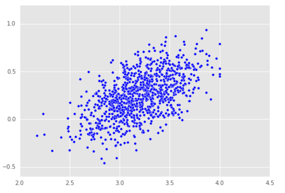
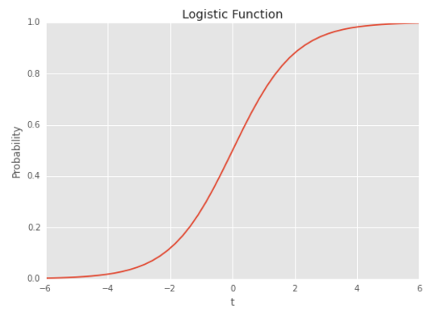

## Classification of Data
We can use machine learning to classify data to one or more
categories. Ex:- Weather a credit card transaction is a fraudulent one
or not, Weather to give loan to a person or not.

##### Classification of data into two groups

Problem Statement: Predict weather a student will get admission to a college or not based on
their gre score and gpa score.

Let's consider that a student getting an admission is denoted by 1 and not
getting an admission is denoted by 0.

Why we should not use Linear Regression for Classification?  
Linear Regression can predict values that are greater than 1 and less
than 0, which is not meaningful.

Why use Logistic Regression for Classification?  
Logistic Regression uses the exponential function or the logit function
et/(1 + et) whose value is always lies between 0
and 1 (including 0 and 1).  
Here 't' = x0 + w1x1 + .. +
wnxn  
In Logistic Regression we measure the probability of the input to
belong to a particular group


from sklearn.linear_model import LogisticRegression

# initialising our logistic model
logistic_model = LogisticRegression()
logistic_model.fit(training_data[['gpa','gre']], training_data['admit'])

# predicting values
predictions =
logistic_model.predict_proba(test_data[['gpa'.'gre']])[:,1]

# predict_proba returns a matrix where
# first column is the probability of the event not happening
# second column is the probability of the event happening


