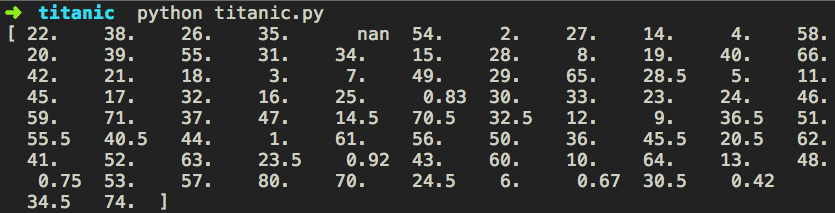

#### Problem Statement:
Given data of a passenger, predict weather the passenger has survived
the disaster or not.

#### Solution:
You can fetch the training data and test data from 
<a href="https://www.kaggle.com/c/titanic/data"
target="_blank">kaggle</a>.

Loading the data:

import pandas as pd

class Titanic:
    def __init__(self, training_file, test_file):
        self.training_data = pd.read_csv(training_file)
        self.test_data = pd.read_csv(test_file)


Analyzing the data:

class Titanic:
    def __init__(self, training_file, test_file):
        self.training_data = pd.read_csv(training_file)
        self.test_data = pd.read_csv(test_file)

    def describe_training_data(self):
        print(self.training_data.describe())

titanic = Titanic('train.csv', 'test.csv')
titanic.describe_training_data()


The count of Age is is 714 where as the count of all other columns is
891. This could mean that we are missing some data for age.

Lets see the list of values the column age has.

Analyzing the data:

import pandas as pd

class Titanic:
    .
    .
    def describe_training_data(self):
        # print(self.training_data.describe())
        print(self.training_data['Age'].unique())

titanic = Titanic('train.csv', 'test.csv')
titanic.describe_training_data()


We can see that some of the values are nan (not defined), lets replace
them with the mean age.

import pandas as pd

class Titanic:
    .
    .
    def describe_training_data(self):
        print(self.training_data.describe())

    def _process_age_for(self, data):
        data['Age'] =
          data['Age'].fillna(self.training_data['Age'].mean())

    def clean_training_data(self):
        self._process_age_for(self.training_data)
        print(self.training_data['Age'].unique())

titanic = Titanic('train.csv', 'test.csv')
titanic.clean_training_data()


There are no more nan values in the Age columns  

Now let's change the value of gender to denote 0 for male and 1 for
female

import pandas as pd

class Titanic:
    .
    .
    def _process_sex_for(self, data):
        # replacing all the sex columns with value as male with 0
        data.loc[ data['Sex'] == "male", "Sex"] = 0
        data.loc[ data['Sex'] == "female", "Sex"] = 1

    def clean_training_data(self):
        self._process_age_for(self.training_data)
        self._process_sex_for(self.training_data)
        print(self.training_data['Sex'].unique())

titanic = Titanic('train.csv', 'test.csv')
titanic.clean_training_data()



Output:  
[0 1]


There were decks A to G on the titanic. We can extract the deck the
passengers rooms were on from the column 'Cabin'. The position of the
rooms and the deck also would effect the survival chances of the
passengers


import pandas as pd
import re
import pdb

class Titanic:
    .
    .
    def _extract_deck(self, cabin):
        if pd.isnull(cabin):
            return
        deck_search = re.search('[A-G]', cabin)
        if deck_search:
            return deck_search.group(0)
        return

    def _extract_room(self, cabin):
        if pd.isnull(cabin):
            return
        room_search = re.search('[0-9]+', cabin)
        if room_search:
            return room_search.group(0)
        return

    def _process_cabin_for(self, data):
        data['Deck'] = data['Cabin'].apply(self._extract_deck)

        # assigning numerical values for the decks depending on the
count
        try:
            self.all_decks
        except:
            self.all_decks =
              pd.value_counts(data['Deck']).keys().tolist()

        for deck in self.all_decks:
            data.loc[ data['Deck'] == deck, 'Deck'] =
              self.all_decks.index(deck)

        data['Deck'] = data['Deck'].fillna(7)

        data['Room'] = data['Cabin'].apply(self._extract_room)
        data['Room'] = data['Room'].fillna(0)

    def clean_training_data(self):
        self._process_age_for(self.training_data)
        self._process_sex_for(self.training_data)
        self._process_cabin_for(self.training_data)

        print(self.training_data['Deck'].unique())

titanic = Titanic('train.csv', 'test.csv')
titanic.clean_training_data()



Output:
  [7 0 3 6 2 4 1 5]


Extracting titles from name as the titles denote status in the society
and could play a role while getting on to the life boats


import pandas as pd
import re
import pdb

class Titanic:
    .
    .
    def _extract_title_from(self, name):
        if pd.isnull(name):
            return
        title_search = re.search('([A-Z][a-z]*)\.', name)
        if title_search:
            return title_search.group(1)
        else:
            return

    def _process_titles(self, data):
        data['Title'] = data['Name'].apply(self._extract_title_from)

        try:
            self.titles
        except:
            self.titles = pd.value_counts(data['Title']).keys().tolist()

        for each_title in self.titles:
            data.loc[ data['Title'] == each_title, 'Encoded Title'] =
              self.titles.index(each_title)

        data['Encoded Title'] = 
          data['Encoded Title'].fillna(len(self.titles) + 1)

    def clean_training_data(self):
        self._process_age_for(self.training_data)
        self._process_sex_for(self.training_data)
        self._process_cabin_for(self.training_data)
        self._process_titles(self.training_data)

        print(self.training_data['Encoded Title'].unique())

titanic = Titanic('train.csv', 'test.csv')
titanic.clean_training_data()


Output:
[  0.   2.   1.   3.  11.   5.   4.  16.  13.   8.  15.   9.   6.   7.
12.  10.  14.]


The family size can also play a role in passenger survival.

import pandas as pd
import re
import pdb

class Titanic:
    .
    .
    def _process_family_size(self, data):
        data['Family Size'] = data['SibSp'] + data['Parch']

    def clean_training_data(self):
        self._process_age_for(self.training_data)
        self._process_sex_for(self.training_data)
        self._process_cabin_for(self.training_data)
        self._process_titles(self.training_data)
        self._process_family_size(self.training_data)

titanic = Titanic('train.csv', 'test.csv')
titanic.clean_training_data()


We need to check the co relation between all features and the survived
column


import pandas as pd
import re
import pdb
import matplotlib
import matplotlib.pyplot as plt
import numpy as np

from sklearn.feature_selection import SelectKBest, f_classif

class Titanic:
    def __init__(self, training_file, test_file):
        self.training_data = pd.read_csv(training_file)
        self.test_data = pd.read_csv(test_file)
        self.all_features = ["Pclass", "Sex", "Age", "SibSp", "Parch",
          "Fare", "Room", "Deck", "Encoded Title", "Family Size"]

    .
    .
    def show_correlation_between_features(self):
        selector = SelectKBest(f_classif, k=10)
        selector.fit( self.training_data[self.all_features],
self.training_data["Survived"])

        scores = -np.log10(selector.pvalues_)

        plt.bar(range(len(self.all_features)), scores)
        plt.xticks(range(len(self.all_features)),
          self.all_features,
          rotation='vertical')
        plt.show()

titanic = Titanic('train.csv', 'test.csv')
titanic.clean_training_data()
titanic.show_correlation_between_features()


We will select only 'Pclass', 'Sex', 'Deck' and 'Encoded Title' in our
predictions as they have the highest co relation amount all the features


class Titanic:
    def __init__(self, training_file, test_file):
        self.training_data = pd.read_csv(training_file)
        self.test_data = pd.read_csv(test_file)
        self.all_features = ["Pclass", "Sex", "Age", "SibSp", "Parch",
          "Fare", "Room", "Deck", "Encoded Title", "Family Size"]
        self.selected_features = ['Pclass', 'Sex', 'Deck',
          'Encoded Title']
    .
    .


We will use KFold to divide our training data into random sets for
training and test data

import pandas as pd
import re
import pdb
import matplotlib
import matplotlib.pyplot as plt
import numpy as np

from sklearn.feature_selection import SelectKBest, f_classif
from sklearn.cross_validation import KFold

class Titanic:
    .
    .
    def use_kfold_to_divide_data(self):
        return KFold(self.training_data.shape[0], 
          n_folds=3, random_state=1)

titanic = Titanic('train.csv', 'test.csv')
titanic.clean_training_data()
#titanic.show_correlation_between_features()
kfold_data = titanic.use_kfold_to_divide_data()


We will use linear regression model to fit our data

import pandas as pd
import re
import pdb
import matplotlib
import matplotlib.pyplot as plt
import numpy as np

from sklearn.feature_selection import SelectKBest, f_classif
from sklearn.cross_validation import KFold
from sklearn.linear_model import LinearRegression

class Titanic:
    .
    .
    def linear_regression_to_predict_from(self, kfold_data):
        predictions = []
        alg = LinearRegression()

        for train, test in kfold_data:
            training_features =
                self.training_data[self.selected_features].iloc[train, :]
            training_target = self.training_data['Survived'].iloc[train]

            alg.fit(training_features, training_target)

            test_predictions = alg.predict(
                self.training_data[self.selected_features].iloc[test, :])
            predictions.append(test_predictions)

        predictions = np.concatenate(predictions, axis = 0)

        predictions[ predictions > 0.5 ] = 1
        predictions[ predictions <= 0.5 ] = 0

        accuracy = sum(predictions[predictions ==
            self.training_data['Survived']]) / len(predictions)
        print("Accuracy using Linear Regression is", accuracy)

titanic = Titanic('train.csv', 'test.csv')
titanic.clean_training_data()
#titanic.show_correlation_between_features()
kfold_data = titanic.use_kfold_to_divide_data()
titanic.linear_regression_to_predict_from(kfold_data)



Output:
Accuracy using Linear Regression is 0.784511784512


Using Logistic Regression to create our prediction model

import pandas as pd
import re
import pdb
import matplotlib
import matplotlib.pyplot as plt
import numpy as np

from sklearn.feature_selection import SelectKBest, f_classif
from sklearn.cross_validation import KFold
from sklearn.linear_model import LinearRegression
from sklearn.linear_model import LogisticRegression
from sklearn import cross_validation

class Titanic:
    .
    .
    def using_logistic_regression_data(self):
        logit_alg = LogisticRegression(random_state=1)
        scores = cross_validation.cross_val_score(logit_alg,
self.training_data[self.selected_features],
                self.training_data['Survived'], cv=3)
        print("Accuracy using Logistic Regression is", scores.mean())

titanic = Titanic('train.csv', 'test.csv')
titanic.clean_training_data()
#titanic.show_correlation_between_features()
kfold_data = titanic.use_kfold_to_divide_data()
titanic.linear_regression_to_predict_from(kfold_data)
titanic.using_logistic_regression_data()



Output:
Accuracy using Logistic Regression is 0.777777777778


Using Random Forest:

import pandas as pd
import re
import pdb
import matplotlib
import matplotlib.pyplot as plt
import numpy as np

from sklearn.feature_selection import SelectKBest, f_classif
from sklearn.cross_validation import KFold
from sklearn.linear_model import LinearRegression
from sklearn.linear_model import LogisticRegression
from sklearn import cross_validation
from sklearn.ensemble import RandomForestClassifier

class Titanic:
    .
    .
    def using_random_forests(self):
        random_forest_alg = RandomForestClassifier(random_state=1,
                n_estimators = 10,
                min_samples_split = 8,
                min_samples_leaf = 4)
        scores = cross_validation.cross_val_score( random_forest_alg,
                self.training_data[self.selected_features],
                self.training_data['Survived'],
                cv=3)
        print("Accuracy using RandomForest is", scores.mean())

titanic = Titanic('train.csv', 'test.csv')
titanic.clean_training_data()
titanic.using_random_forests()


Output:
Accuracy using RandomForest is 0.773288439955


Using Gradient Boosting:

import pandas as pd
import re
import pdb
import matplotlib
import matplotlib.pyplot as plt
import numpy as np

from sklearn.feature_selection import SelectKBest, f_classif
from sklearn.cross_validation import KFold
from sklearn.linear_model import LinearRegression
from sklearn.linear_model import LogisticRegression
from sklearn import cross_validation
from sklearn.ensemble import RandomForestClassifier
from sklearn.ensemble import GradientBoostingClassifier

class Titanic:
    .
    .
    def using_ensembling(self, kfold_data):
        algs = [
                [ GradientBoostingClassifier( random_state=1,
                    n_estimators=25, max_depth=3),
                    ["Pclass", "Sex", "Age", "Encoded Title", "Deck"]],
                [ LogisticRegression( random_state=1),
                    ["Pclass", "Sex", "Age", "Encoded Title", "Deck"]]
                ]
        predictions = []
        for train, test in kfold_data:
            train_target = self.training_data['Survived'].iloc[train]
            full_test_predictions = []
            for alg, features in algs:
                alg.fit(self.training_data[features].iloc[train, :],
                  train_target)

                test_predictions = alg.predict_proba(
                            self.training_data[features].iloc[test,
                              :].astype(float))[:,1]
                full_test_predictions.append(test_predictions)

            test_predictions = (full_test_predictions[0] * 3  +
              full_test_predictions[1])/4
            test_predictions[ test_predictions > 0.5] = 1
            test_predictions[ test_predictions <= 0.5] = 0
            predictions.append(test_predictions)

        predictions = np.concatenate(predictions, axis=0)

        accuracy = sum(predictions[predictions ==
          self.training_data['Survived']])/len(predictions)

        print("Accuracy using Ensembling is", accuracy)

titanic = Titanic('train.csv', 'test.csv')
kfold_data = titanic.use_kfold_to_divide_data()
titanic.using_ensembling(kfold_data)



Output:
Accuracy using Ensembling is 0.786756453423

